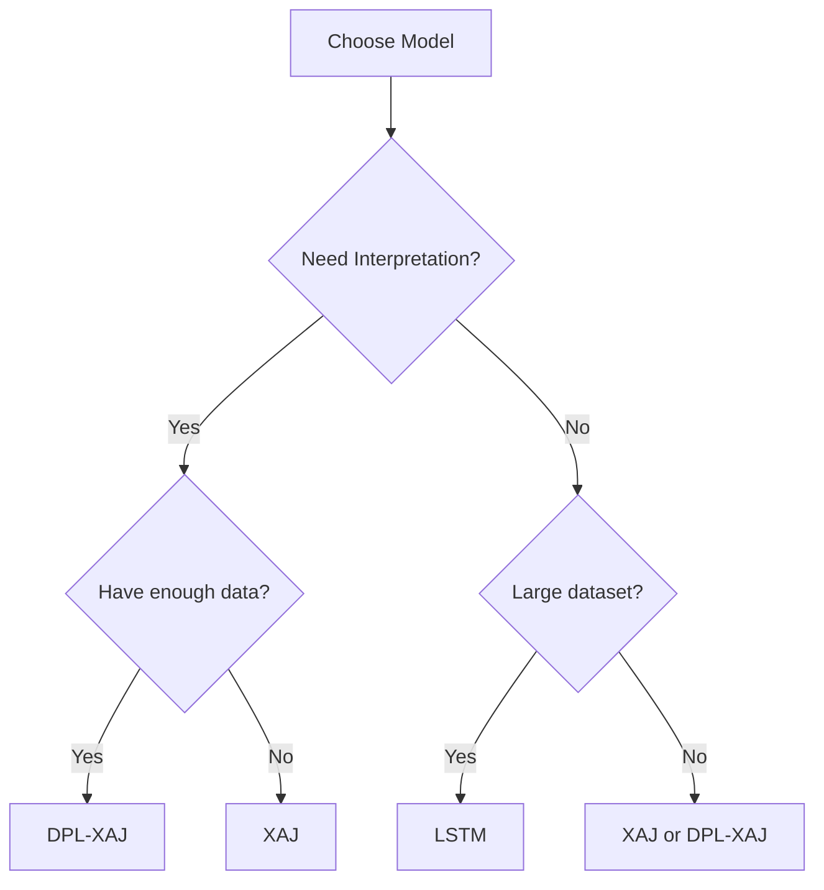

# Models Overview

HydroDHM provides three types of hydrological models, each with distinct advantages.

## Model Types

### 1. XAJ (Xin'anjiang Model)

**Type**: Physics-based conceptual model

**Key Features**:
- Based on physical hydrological processes
- Interpretable parameters
- Well-established in hydrology community
- Fast calibration

**Best For**:
- Physical understanding of catchment behavior
- Limited data scenarios
- Traditional hydrological analysis
- Parameter regionalization

[Learn more →](xaj/introduction.md)

### 2. LSTM (Long Short-Term Memory)

**Type**: Pure deep learning

**Key Features**:
- Data-driven neural network
- Captures complex nonlinear relationships
- No prior hydrological knowledge needed
- State-of-the-art accuracy

**Best For**:
- Large datasets (many basins, long records)
- Pure prediction tasks
- When physical interpretation is not critical
- Benchmark comparisons

[Learn more →](deep-learning/lstm.md)

### 3. DPL-XAJ (Differentiable Parameter Learning + XAJ)

**Type**: Hybrid physics-constrained deep learning

**Key Features**:
- Combines LSTM with XAJ model
- Neural network learns XAJ parameters
- Physics-based constraints
- Interpretable and accurate

**Best For**:
- When you want both accuracy and interpretability
- Limited data with physical constraints
- Understanding hydrological processes with ML
- Research on hybrid modeling

[Learn more →](deep-learning/dpl-xaj.md)

## Performance Comparison

Based on CAMELS-US experiments (671 basins):

| Model | NSE (Median) | Training Time | Interpretability | Data Requirements |
|-------|--------------|---------------|------------------|-------------------|
| XAJ | 0.65 | Minutes | ★★★★★ | Low |
| LSTM | 0.75 | Hours | ★ | High |
| DPL-XAJ | 0.73 | Days | ★★★★ | Medium |

## Model Selection Guide

### Decision Flowchart

**Start here**:

1. **Do you need physical interpretation?**
   - Yes → Go to 2
   - No → Go to 3

2. **Do you have sufficient training data (>50 basins or >10 years)?**
   - Yes → **DPL-XAJ** (best of both worlds)
   - No → **XAJ** (traditional calibration)

3. **Do you have large datasets (>100 basins, >20 years)?**
   - Yes → **LSTM** (highest accuracy)
   - No → **XAJ** (reliable baseline)

## Model Characteristics

### XAJ Model

**Parameters** (15):
- K, B, IM, WM, WUM, WLM, C, SM, EX, KI, KG, A, θ, CI, CG

**Inputs**:
- Precipitation
- Potential evapotranspiration

**Outputs**:
- Streamflow
- Soil moisture states
- Evapotranspiration

### LSTM Model

**Architecture**:
- Input: Forcings + Basin attributes
- LSTM layers (256 hidden units)
- Output: Streamflow

**Inputs** (configurable):
- Precipitation
- Temperature (min/max)
- Radiation
- Vapor pressure
- +Basin attributes

**Outputs**:
- Streamflow

### DPL-XAJ Model

**Architecture**:
- LSTM → Parameter network → XAJ model

**Inputs**:
- Precipitation
- Potential ET
- Basin attributes

**Outputs**:
- Streamflow
- XAJ parameters (dynamic)
- Intermediate states

## Computational Requirements

| Model | CPU | GPU | Memory | Storage |
|-------|-----|-----|--------|---------|
| XAJ | ✓ | - | <1 GB | <100 MB |
| LSTM | ✓ | Recommended | 2-8 GB | 1-5 GB |
| DPL-XAJ | ✓ | Required | 4-16 GB | 2-10 GB |

## Next Steps

- [XAJ Model Guide](xaj/introduction.md)
- [LSTM Training](deep-learning/lstm.md)
- [DPL-XAJ Training](deep-learning/dpl-xaj.md)
- [Tutorials](../tutorials/xaj-calibration.md)
